# マルチエージェントオーケストレーションを用いた Safe Travels Agent の構築と強化

### 全体の推定所要時間：1時間

## 概要

このハンズオンラボでは、Microsoft Copilot Studio を使用して Safe Travels Agent を構築および構成し、従業員の出張計画、ポリシーに関する問い合わせ、承認ワークフローを支援します。このエージェントはマルチエージェントオーケストレーションを活用し、休暇残高の照会などの専門的なタスクを、専用の Leave Manager Agent にシームレスに委譲します。Microsoft Teams および Power Automate と統合することで、従業員体験を向上させ、業務プロセスを効率化するインテリジェントで自動化されたシステムを構築します。

## 目的

このラボを完了すると、以下が可能になります：

- **Safe Travels Agent の作成とデプロイ：** テンプレートを使用して出張支援エージェントを構築し、ナレッジソースを統合し、Microsoft Teams にデプロイします。

- **業務自動化のためのエージェントフローの実装：** 出張承認プロセスをトリガーし、Teams チャネルに通知を投稿する Power Automate フローを設計および構成します。

- **マルチエージェントオーケストレーションの構築：** 専門的な Leave Manager Agent を作成し、複数のエージェント間で連携できるようにして、包括的なビジネスソリューションを実現します。

- **エンドツーエンドのワークフローのテスト：** エージェントの応答、フローの実行、エージェント間のハンドオフを検証し、信頼性の高い動作を確保します。

## 前提条件

- 会話型 AI およびエージェント型 AI の基本的な理解  
- Microsoft Copilot Studio の実務知識  
- Microsoft Teams および Power Platform の基本的な知識  

## コンポーネントの説明

- **Microsoft Copilot Studio：** 会話型 AI エージェントを構築、構成、管理するためのプラットフォーム  

- **Dataverse：** 従業員情報、休暇残高、出張ポリシーを格納する中央データストア  

- **Power Platform 環境：** エージェント、データテーブル、ワークフローをホストする安全なワークスペース  

- **Power Automate：** 出張承認プロセスおよび Teams 連携のためのワークフロー自動化エンジン  

- **Microsoft Teams：** ユーザーがエージェントとやり取りし、承認通知を受け取るコラボレーションハブ  

- **マルチエージェントオーケストレーション：** 専門的なエージェント同士が連携し、リクエストをインテリジェントに振り分けるフレームワーク  

## ラボの開始

「マルチエージェントオーケストレーションを用いた Safe Travels Agent の構築と強化」ラボへようこそ！このラボでは、インテリジェントな出張支援エージェントの構築、構成、およびテスト方法を体験できる環境が用意されています。AI エージェントの作成、業務自動化ワークフローの実装、マルチエージェントオーケストレーションの確立を通じて、安全で効率的な体験の提供方法を学びます。

### ラボ環境へのアクセス

準備が整うと、仮想マシンおよびラボガイドは Web ブラウザー上ですぐに利用できます。


### ラボリソースの確認

ラボのリソースや資格情報を確認するには、Environment タブに移動してください。


### 分割ウィンドウ機能の活用

利便性向上のため、右上の Split Window ボタンを選択すると、ラボガイドを別ウィンドウで開くことができます。


### 仮想マシンの管理

**Resources (1)** タブから、仮想マシンの **起動、停止、再起動、接続 (2)** を簡単に行えます。すべての操作はあなたの手元で管理できます！


## Power Apps ポータルを始めましょう

1. JumpVM 上で、デスクトップにある **Microsoft Edge** ブラウザーのショートカットをクリックします。

   

1. 新しいブラウザータブを開き、以下の URL を入力して Power Apps ポータルにアクセスします。

   ```
   https://make.powerapps.com/
   ```

1. **Sign into Microsoft** タブで、メール欄に以下のメールアドレスを入力 **(1)** し、**Next (2)** をクリックして続行します。

   - Email: **<inject key="AzureAdUserEmail"></inject>**

     

1. **Enter Temporary Access Pass** 画面で、以下の **一時アクセスパス (Temporary Access Pass)** を入力し、**Sign in (2)** をクリックします。
   
   - Temporary Access Pass: **<inject key="AzureAdUserPassword"></inject>**

     
     
1. **Stay Signed in?（サインイン状態を維持しますか？）** のポップアップが表示された場合は、**No** をクリックします。

   

1. **Welcome to Power Apps** のポップアップが表示された場合は、既定の国/地域の選択のままにして、**Get started** を選択します。

   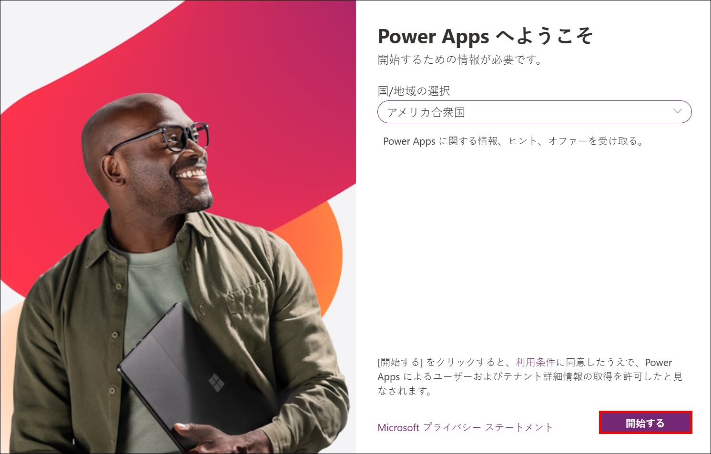

1. これで Power Apps ポータルへのログインが正常に完了しました。このままポータルを開いた状態にしておきます。

   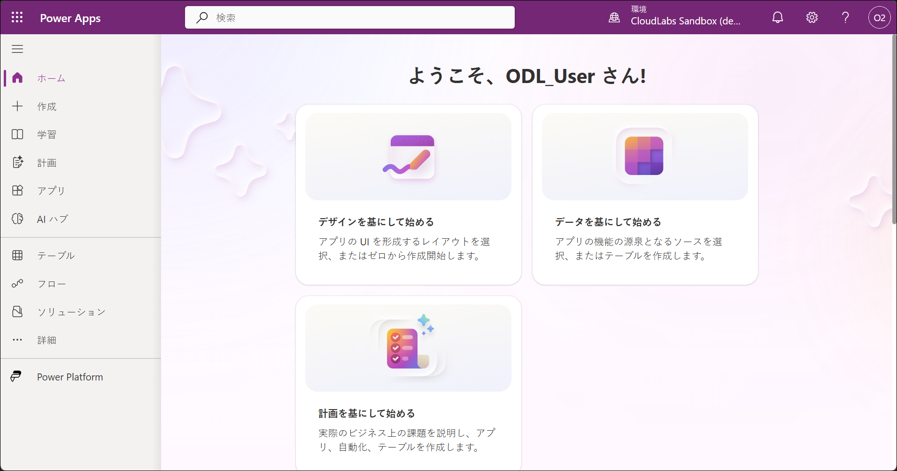

   > **注:** Power Apps ポータルにサインインすることで、自動的に Developer ライセンスが割り当てられます。このライセンスは、次の手順で Developer 環境を作成および使用するために必要です。

1. Power Apps ポータルで、左側メニューから **Tables (1)** を選択し、**Create a database (2)** を選択します。

   > **注:** **Create Database** オプションが表示されず、すでにいくつかのテーブルが表示されている場合は、**ステップ 10** から続行してください。

1. 新しいデータベースを作成するためのペインで、**Create my Database** を選択します。

1. 完了したら、**Create with Excel or .CSV file** を選択します。

   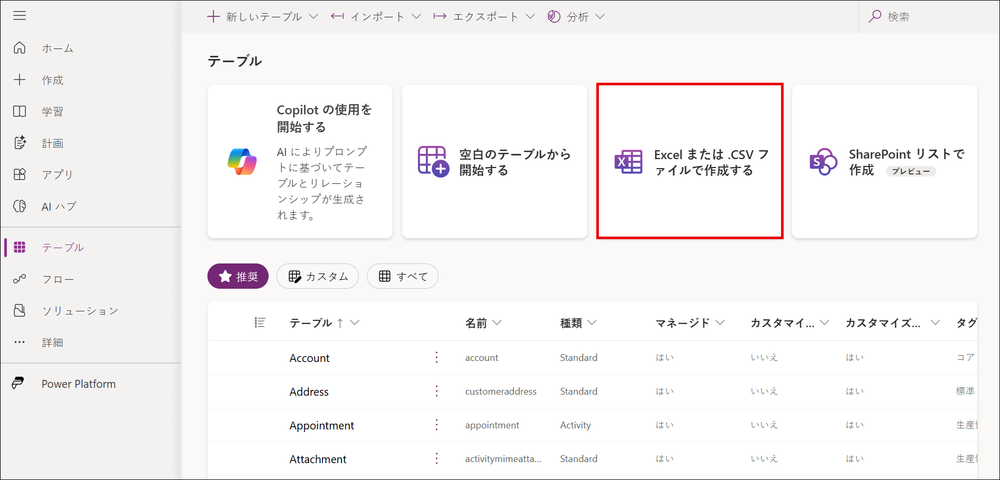

1. 環境を作成するポップアップウィンドウで、**Create** を選択します。これにより、新しい Power Platform の開発者環境が作成されます。

1. 新しいブラウザータブを開き、以下の URL を入力して Power Platform 管理センターにアクセスします。

   ```
   https://admin.powerplatform.microsoft.com
   ```

1. **Power Platform 管理センター** で、**Manage (1)** を選択し、次に **Environments (2)** を選択し、その後 **ODL_User &lt;inject key="DeploymentID" enableCopy="false"/&gt; の環境 (3)** を選択します。

   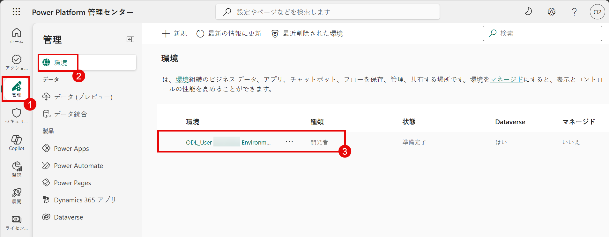

   > 注: 環境が表示されない場合は、バックグラウンドでまだ作成中である可能性があります。これは Power Platform における正常な動作です。15～20分ほど待ってからページを更新してください。

1. 環境ページで、**S2S apps** の下にある **See all** を選択します。

   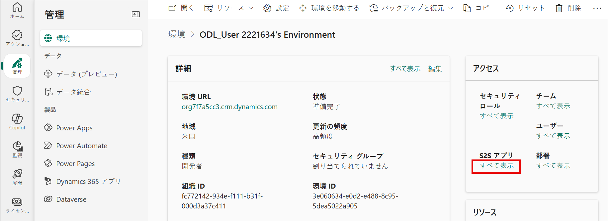

1. 次のペインで、**+ New app user** を選択します。

   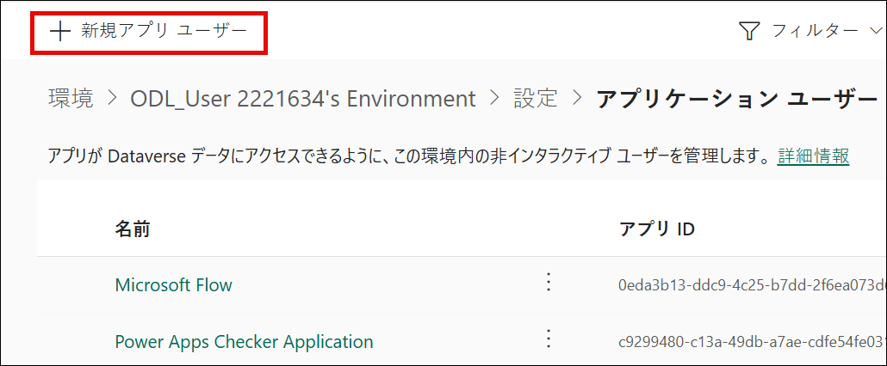

1. **Create a new app user** ペインで、**App** の下にある **+ Add an app** を選択します。

   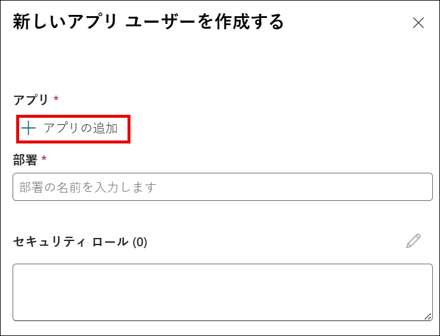

1. **Add an app from Microsoft Entra ID** ペインで、検索ボックスに以下の URL を入力 **(1)** し、結果からアプリを選択 **(2)**、その後 **Add (3)** を選択します。

   ```
   https://cloudlabssandbox.onmicrosoft.com/cloudlabs.ai/
   ```

      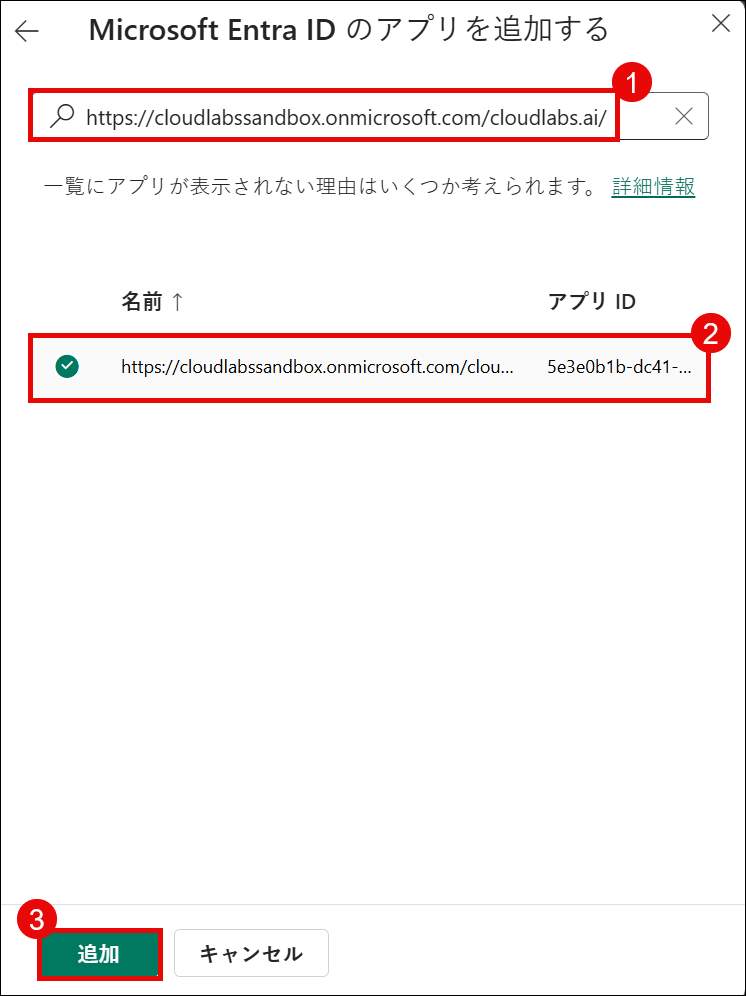

1. Business Unit の下で、テキスト入力フィールドをクリックして利用可能なオプションを表示し、一覧からいずれかのビジネスユニットを選択します。

   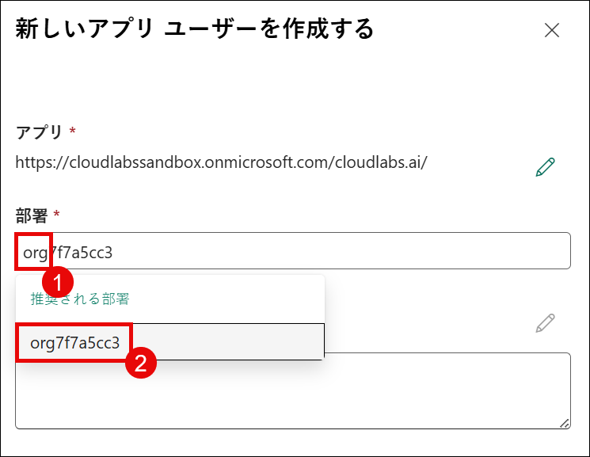

1. **Security roles** の横にある **Edit** アイコンを選択します。

   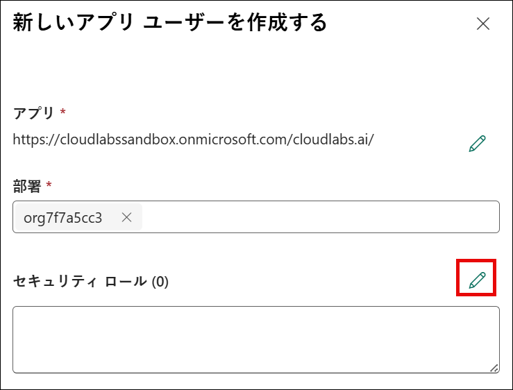

1. **Sync Permissions** ペインで、**System Administrator (1)** を選択し、その後 **Save (2)** を選択します。

   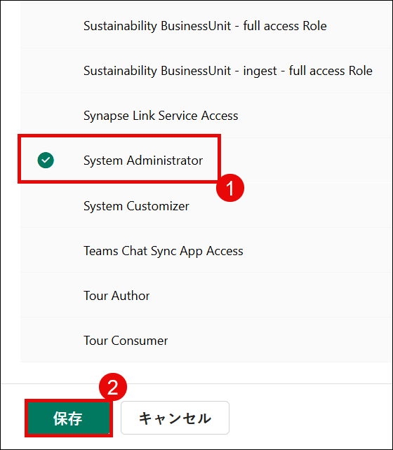

1. ポップアップウィンドウで、**Save** を選択します。

   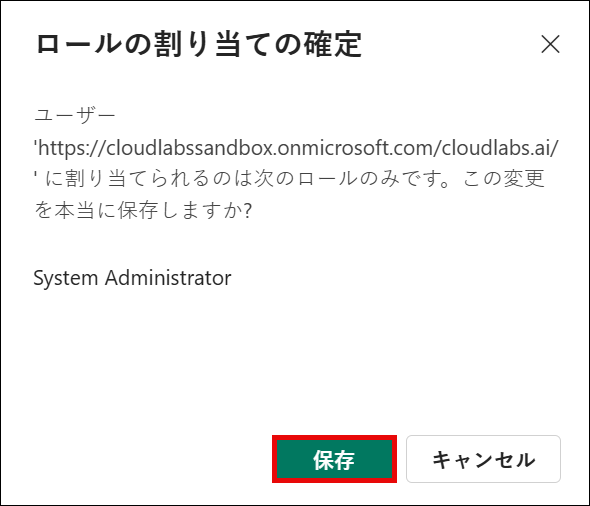

1. すべての詳細を確認し、**Create** を選択します。

   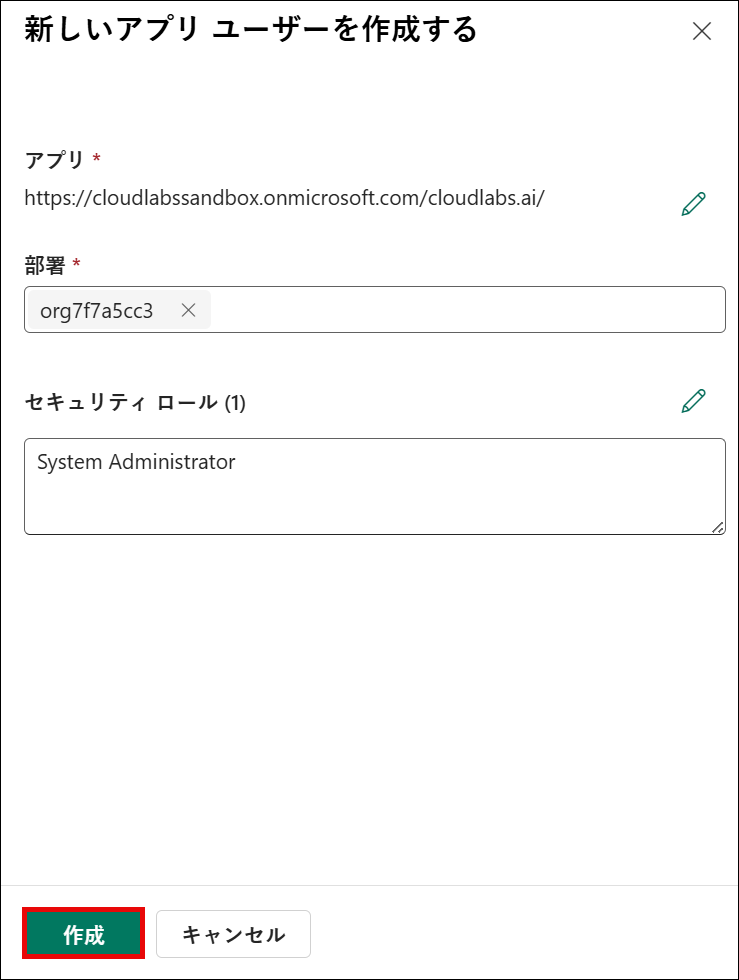

## Support Contact

The CloudLabs support team is available 24/7, 365 days a year, via email and live chat to ensure seamless assistance at any time. We offer dedicated support channels tailored specifically for both learners and instructors, ensuring that all your needs are promptly and efficiently addressed.

Learner Support Contacts:

- Email Support: cloudlabs-support@spektrasystems.com
- Live Chat Support: https://cloudlabs.ai/labs-support

Now, click on the **Next** from lower right corner to move on next page.

   

## Happy Learning!!
