# マルチエージェントオーケストレーションを用いた Safe Travels Agent の構築と強化

### 全体の推定所要時間：1時間

## 概要

このハンズオンラボでは、Microsoft Copilot Studio を使用して Safe Travels Agent を構築および構成し、従業員の出張計画、ポリシーに関する問い合わせ、承認ワークフローを支援します。このエージェントはマルチエージェントオーケストレーションを活用し、休暇残高の照会などの専門的なタスクを、専用の Leave Manager Agent にシームレスに委譲します。Microsoft Teams および Power Automate と統合することで、従業員体験を向上させ、業務プロセスを効率化するインテリジェントで自動化されたシステムを構築します。

## 目的

このラボを完了すると、以下が可能になります：

- **Safe Travels Agent の作成とデプロイ：** テンプレートを使用して出張支援エージェントを構築し、ナレッジソースを統合し、Microsoft Teams にデプロイします。

- **業務自動化のためのエージェントフローの実装：** 出張承認プロセスをトリガーし、Teams チャネルに通知を投稿する Power Automate フローを設計および構成します。

- **マルチエージェントオーケストレーションの構築：** 専門的な Leave Manager Agent を作成し、複数のエージェント間で連携できるようにして、包括的なビジネスソリューションを実現します。

- **エンドツーエンドのワークフローのテスト：** エージェントの応答、フローの実行、エージェント間のハンドオフを検証し、信頼性の高い動作を確保します。

## 前提条件

- 会話型 AI およびエージェント型 AI の基本的な理解  
- Microsoft Copilot Studio の実務知識  
- Microsoft Teams および Power Platform の基本的な知識  

## コンポーネントの説明

- **Microsoft Copilot Studio：** 会話型 AI エージェントを構築、構成、管理するためのプラットフォーム  

- **Dataverse：** 従業員情報、休暇残高、出張ポリシーを格納する中央データストア  

- **Power Platform 環境：** エージェント、データテーブル、ワークフローをホストする安全なワークスペース  

- **Power Automate：** 出張承認プロセスおよび Teams 連携のためのワークフロー自動化エンジン  

- **Microsoft Teams：** ユーザーがエージェントとやり取りし、承認通知を受け取るコラボレーションハブ  

- **マルチエージェントオーケストレーション：** 専門的なエージェント同士が連携し、リクエストをインテリジェントに振り分けるフレームワーク  

## ラボの開始

「マルチエージェントオーケストレーションを用いた Safe Travels Agent の構築と強化」ラボへようこそ！このラボでは、インテリジェントな出張支援エージェントの構築、構成、およびテスト方法を体験できる環境が用意されています。AI エージェントの作成、業務自動化ワークフローの実装、マルチエージェントオーケストレーションの確立を通じて、安全で効率的な体験の提供方法を学びます。

### ラボ環境へのアクセス

準備が整うと、仮想マシンおよびラボガイドは Web ブラウザー上ですぐに利用できます。

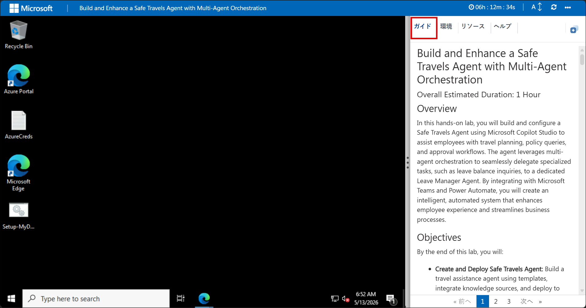

### ラボリソースの確認

ラボのリソースや資格情報を確認するには、Environment タブに移動してください。

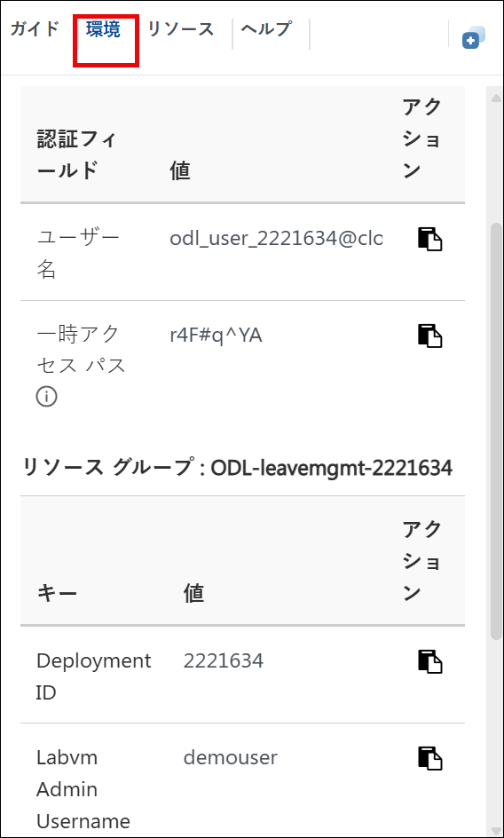

### 分割ウィンドウ機能の活用

利便性向上のため、右上の Split Window ボタンを選択すると、ラボガイドを別ウィンドウで開くことができます。

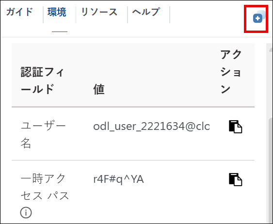

### 仮想マシンの管理

**Resources (1)** タブから、仮想マシンの **起動、停止、再起動、接続 (2)** を簡単に行えます。すべての操作はあなたの手元で管理できます！

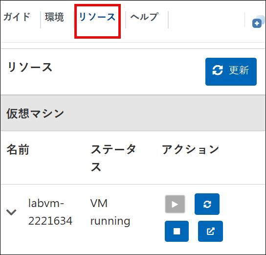


## Power Apps ポータルを始めましょう

1. JumpVM 上で、デスクトップにある **Microsoft Edge** ブラウザーのショートカットをクリックします。

   

1. 新しいブラウザータブを開き、以下の URL を入力して Power Apps ポータルにアクセスします。

   ```
   https://make.powerapps.com/
   ```

1. On the **Sign into Microsoft** tab, enter the following email **(1)** in the email field, and then click **Next (2)** to proceed.

   - Email: **<inject key="AzureAdUserEmail"></inject>**

     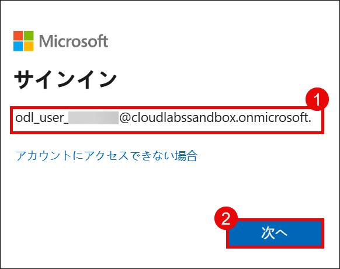

1. On the **Enter Temporary Access Pass** screen, enter the following **Temporary Access Pass**, and then click **Sign in (2)**.

   - Temporary Access Pass: **<inject key="AzureAdUserPassword"></inject>**

     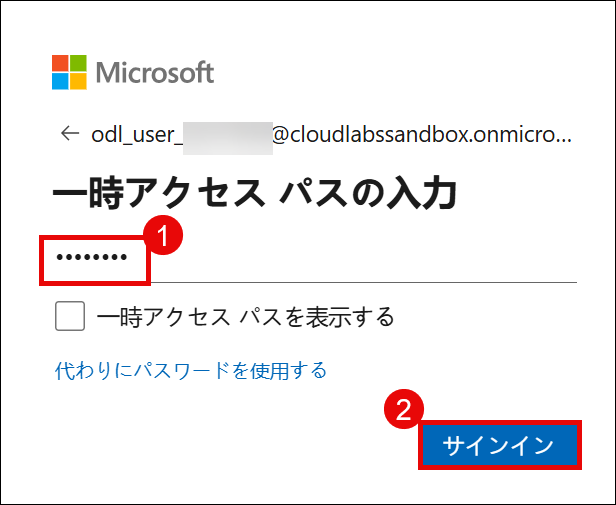
     
1. If you see the pop-up **Stay Signed in?**, click **No**.

   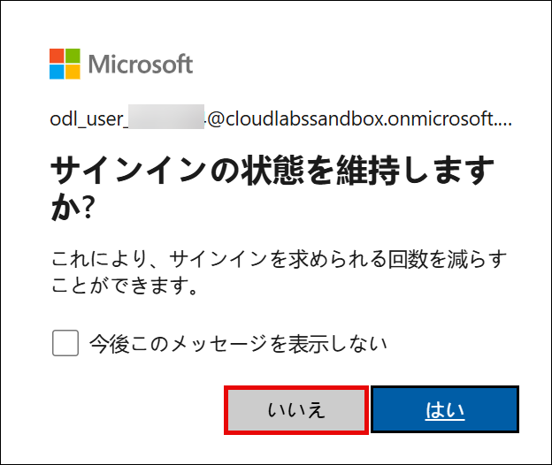

1. If the **Welcome to Power Apps** pop-up appears, leave the default country/region selection and click **Get started**.

   

1. You have now successfully logged in to the Power Apps portal. Keep the portal open.

   

   > **Note:** We are signing in to the Power Apps portal because it automatically assigns a Developer license, which is required to create and use a Developer environment in the next steps.

1. Open a new browser tab and navigate to the Power Platform admin center by entering the following URL:

   ```
   https://admin.powerplatform.microsoft.com
   ```

1. In the **Power Platform admin center**, select **Manage** from the left navigation pane.

   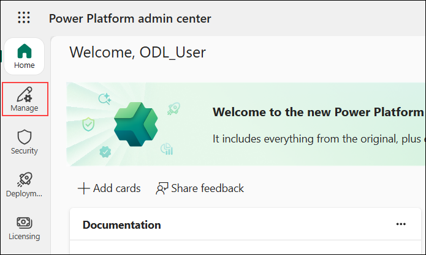

1. In the Power Platform admin center, select **Environments (1)** from the left navigation pane, and then choose **New (2)** to create a new environment.

   

1. In the **New environment** pane, configure the environment with the following settings, and then select **Next (3)**:

   - Select **Developer (1)** from the **Type** dropdown.
   - Enter **ODL_User <inject key="DeploymentID" enableCopy="false"></inject>'s Environment** in the **Name (2)** field.

      

1. In the **Add Dataverse** pane, leave all settings as default, and then select **Save**.

   

   > **Environment Foundation:** This step creates the foundational environment that will support your agents with company-specific data and knowledge sources.

   > **Note:** Environment provisioning may take 10-15 minutes to complete. Wait until the status shows as ready before proceeding.

   > **Note:** If you see an error stating that the environment list cannot be displayed, this is expected while the environment is being created in the background. After 10-15 minutes, refresh the browser and the environment should appear.

1. In the **Power Platform admin center**, select **Manage (1)**, choose **Environments (2)**, and then click **ODL_User <inject key="DeploymentID" enableCopy="false"/>'s Environment (3)**.

   

1. In the environment page, click on **See all** under **S2S apps**.

   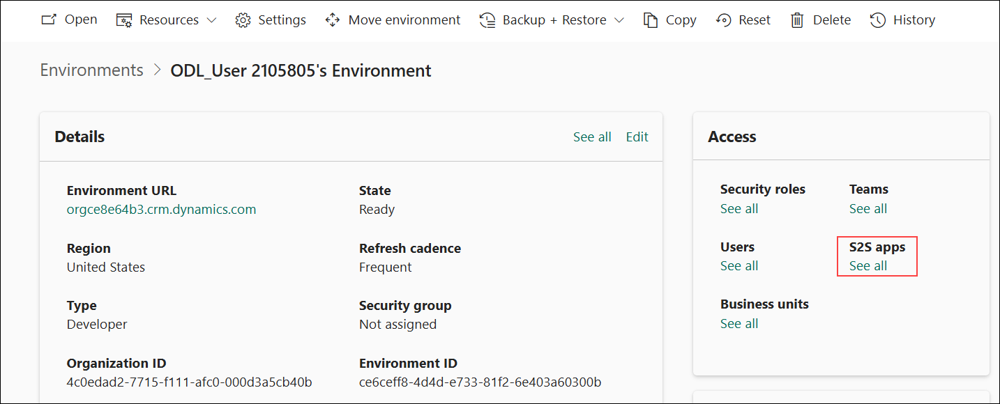

1. In the next pane, click on **+ New app user**.

   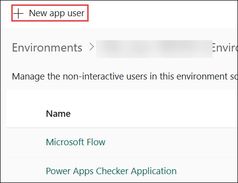

1. In the create a new app user pane, under **App**, click on **+ Add an app**.

   

1. In the **Add an app from Microsoft Entra ID** pane, enter the URL provided below in the search box **(1)**, select the app from the results **(2)**, and then click **Add (3)**.

   ```
   https://cloudlabssandbox.onmicrosoft.com/cloudlabs.ai/
   ```

   

1. Under **Business unit**, enter **org (1)** in the search box, and then select the available business unit from the list **(2)**.

   

1. Beside **Security roles** click on **Edit** icon.

   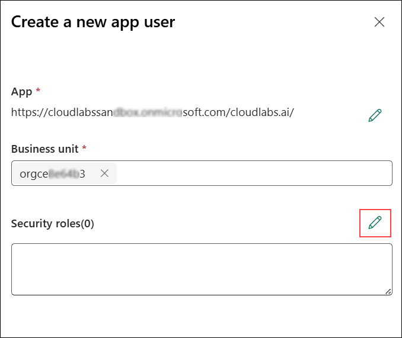

1. In the **Sync Permissions** pane, select **System Administrator (1)**, and then click **Save (2)**.

   

1. In the pop-up window, select **save**.

   

1. Review all the details and click on **Create**.

   

## Support Contact

The CloudLabs support team is available 24/7, 365 days a year, via email and live chat to ensure seamless assistance at any time. We offer dedicated support channels tailored specifically for both learners and instructors, ensuring that all your needs are promptly and efficiently addressed.

Learner Support Contacts:

- Email Support: cloudlabs-support@spektrasystems.com
- Live Chat Support: https://cloudlabs.ai/labs-support

Now, click on the **Next** from lower right corner to move on next page.

   

## Happy Learning!!
